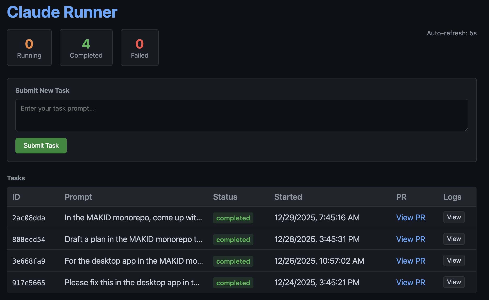
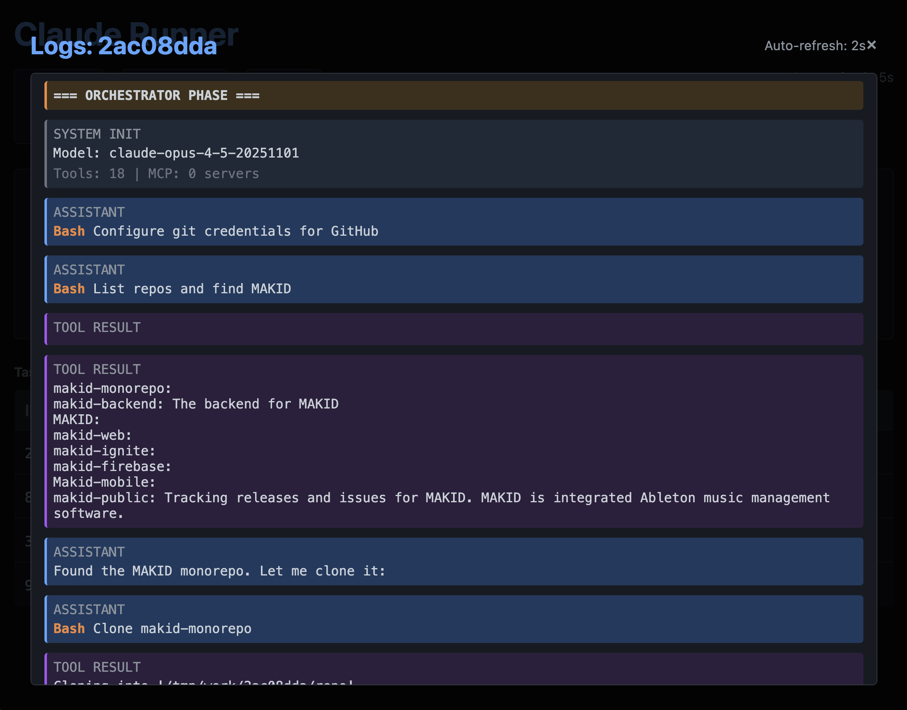

# Claude Code Runner

[](https://hub.docker.com/r/ericvtheg/claude-code-runner)
[](https://hub.docker.com/r/ericvtheg/claude-code-runner)
[](https://github.com/ericvtheg/claude-code-runner)
[](https://opensource.org/licenses/MIT)

Self hostable Claude Code runner to execute prompts from anywhere. Container accepts task prompts via HTTP and spawns Claude Code instance to autonomously implement them. Includes an integrated dashboard to submit tasks and monitor progress. Makes use of your Claude Code subscription instead of requiring an API key.

## Security & Authentication

This service includes username/password authentication. On first visit, you'll be prompted to create an administrator account. After setup, all dashboard and API access requires authentication.

**First-time setup:**
1. Navigate to the dashboard URL
2. You'll be redirected to the setup page
3. Create a username and password (min 8 characters)
4. You'll be automatically logged in

Credentials are stored in a JSON file (default: `/data/auth.json`) with bcrypt-hashed passwords. Mount a persistent volume to preserve credentials across container restarts.

> **Note:** While authentication protects the dashboard, it's HIGHLY recommended to host behind a VPN or private network for security.

## How it Works

Claude Code uses your authenticated session from your OS (no API key). Claude Code will use your provided Github token to find your relevant repository, clone it, make requested changes based on your prompt, then open a PR. 

## Architecture

The system uses a two-stage LLM architecture:

### Orchestrator 

The first Claude instance receives your prompt and is responsible for:
- Parsing your task to identify which repository you're referring to
- Searching your GitHub repos via the `gh` CLI
- Cloning the target repository and setting up the environment
- Spawning a Worker Claude inside the cloned repo

The orchestrator handles all the setup so the worker can focus purely on coding.

### Worker 

A second Claude instance runs inside the cloned repository and:
- Picks up the repo's existing `.claude/`, `.mcp.json`, and skills
- Opens a draft PR immediately so you can watch progress
- Commits and pushes after every logical change (no batching)
- Spawns subagents for complex tasks to preserve context
- On failure: commits current state, updates PR with blockers, then exits cleanly

## Dashboard

Dashboard view, fire prompts from here, and view running tasks.



Log view, watch real time updates of task runners.



## Quick Start

```bash
docker pull ericvtheg/claude-code-runner:latest
```

```yaml
services:
  claude-runner:
    image: ericvtheg/claude-code-runner:latest
    container_name: claude-code-runner
    ports:
      - "7334:3000"
    environment:
      - GITHUB_TOKEN=${GITHUB_TOKEN}
      - PORT=3000
      - SESSION_SECRET=${SESSION_SECRET}  # Optional: set for consistent sessions across restarts
    volumes:
      - ~/.claude/.credentials.json:/home/node/.claude/.credentials.json:ro
      - claude-data:/data  # Persistent auth credentials and API tokens
    restart: unless-stopped

volumes:
  claude-data:
```

## API Token Authentication

For programmatic API access (scripts, CI/CD, external services), generate an API token through the dashboard:

1. Open the dashboard at `http://localhost:7334`
2. Click "Generate New Token"
3. Copy the token (shown once, starts with `ccr_`)
4. Use in API requests: `Authorization: Bearer ccr_...`

Tokens are persisted in `/data/token.json`. Mount a volume to preserve across restarts.

### API Endpoints

| Endpoint | Auth Required | Description |
|----------|---------------|-------------|
| `POST /token/generate` | Session only | Generate new API token |
| `GET /token` | No | Get masked token status |
| `DELETE /token` | No | Revoke current token |
| `POST /task` | Yes | Submit new task |
| `GET /task/:id` | Yes | Get task status |
| `GET /task/:id/logs` | Yes | Stream task logs |
| `GET /tasks` | Yes | List all tasks |
| `GET /health` | No | Health check |

## API

```bash
# Submit a task (with API token)
curl -X POST http://localhost:7334/task \
  -H "Content-Type: application/json" \
  -H "Authorization: Bearer ccr_your_token_here" \
  -d '{"prompt": "In the acme-api repo, fix the token refresh bug"}'

# Check status
curl -H "Authorization: Bearer ccr_your_token_here" \
  http://localhost:7334/task/<id>

# View logs
curl -H "Authorization: Bearer ccr_your_token_here" \
  http://localhost:7334/task/<id>/logs

# Health check (no auth required)
curl http://localhost:7334/health
```

## Docker Image Tags

The project publishes Docker images to Docker Hub with the following tagging strategy:

- **Version tags** (e.g., `1.4.1`): Internal release images created automatically on every push to `main` that triggers a semantic release. Use these for testing new features before they're promoted to latest.
- **`latest` tag**: Stable release promoted manually via GitHub Actions. This is the recommended tag for production use.

## Integrations

### Clawdbot

[Clawdbot](https://github.com/clawdbot/clawdbot) is an AI assistant framework that can use Claude Code Runner as a skill. This allows AI agents to programmatically submit coding tasks and monitor their progress.

**Quick setup:**
1. Copy the [`integrations/clawdbot/`](integrations/clawdbot/) folder into your Clawdbot workspace
2. Set `CLAUDE_RUNNER_URL` and `CLAUDE_RUNNER_TOKEN` environment variables
3. The skill is now available for your AI agents to use

**Programmatic usage example:**

```bash
# Submit a task
curl -X POST http://homelab:7334/task \
  -H "Authorization: Bearer ccr_your_token" \
  -H "Content-Type: application/json" \
  -d '{"prompt": "In my-org/my-repo, add unit tests for the auth module"}'

# Response: {"id": "abc123", "status": "running", ...}
```

See [`integrations/clawdbot/SKILL.md`](integrations/clawdbot/SKILL.md) for complete API documentation, example prompts, and workflow details.

## Requirements

- `GITHUB_TOKEN` with repo scope
- Claude authentication from your host machine

### Claude Authentication

The container uses your existing Claude Code authentication from the host machine. Before running the container, authenticate Claude Code on your host:

```bash
# On your host machine (not in Docker)
claude

# Follow the login prompts to authenticate with your subscription
```

This creates credentials at `~/.claude/.credentials.json` which gets mounted into the container as a read-only file. Only the OAuth credentials file is shared with the container - debug logs and other runtime files stay inside the container and don't pollute your host's `~/.claude` directory.
